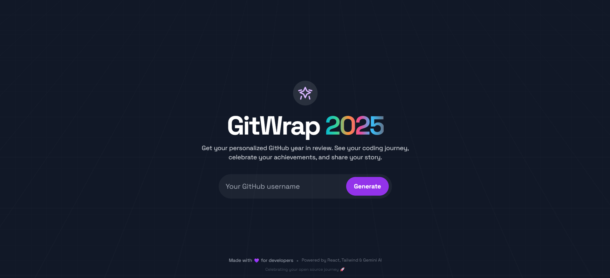

<div align="center">
  <a href="https://gitwrap-2025.vercel.app" target="_blank" rel="noreferrer">
    
  </a>

  <p style="margin-top:12px;font-size:18px;">Showcase your 2025 GitHub contributions with a polished, customizable year-in-review card - themeable, concise, and ready to share.</p>
</div>

# GitWrap 2025

> Create a polished year-in-review card for your GitHub contributions and share it with your network.

Live : https://gitwrap-2025.vercel.app

## ✨ Highlights

- **Personalized Stats:** Commits, PRs, Issues, and Reviews aggregated into one card.
- **Multiple Themes:** Choose from several visually appealing layouts and color schemes.
- **Shareable Export:** Export your card as an image for LinkedIn, Twitter, or personal sites.
- **Fast & Lightweight:** Built with Vite + React and TypeScript for snappy UX.
 - **AI (Text Only):** Uses Gemini API for text generation. 

## 🚀 Quick Start (Development)

These steps get you running locally for development and testing.

### Prerequisites

- Node.js (v18+ recommended)
- `npm` or `yarn`

### Install & Run

1. Clone the repo:

```powershell
git clone https://github.com/aftab-s/gitwrap-2025.git
cd gitwrap-2025
```

2. Install dependencies:

```powershell
npm install
```

3. Add environment variables by creating a `.env.local` file in the project root:

```env
VITE_GEMINI_API_KEY=your_google_gemini_api_key
VITE_GITHUB_APP_TOKEN=your_github_personal_access_token
```

4. Run the dev server:

```powershell
npm run dev
```

The development server runs on `http://localhost:3000` — open that URL after starting the server.

## 🧩 Project Structure (Top-level)

- `src/` — React components and app logic
- `public/images/` — banner and imagery used in the README and app
- `api/` — serverless endpoints

## 🎯 Tips for a Great Card

- Try different themes in the app to find the best contrast for sharing on social.
- Use the `Export` option to download a image.

## 🤝 Contributing

Contributions are welcome. Open an issue for discussion or submit a PR with your changes.

Short checklist for PRs:

- Update or add tests if applicable
- Keep changes focused and documented

## 🙏 Credits

Built by the `GitWrap` contributors. Hosted on Vercel: https://gitwrap-2025.vercel.app

## 👥 Contributors

This project is built and maintained by our amazing contributors. Thank you for your contributions!

<a href="https://github.com/aftab-s/gitwrap-2025/graphs/contributors">
  
</a>

---

Happy wrapping! 🎁